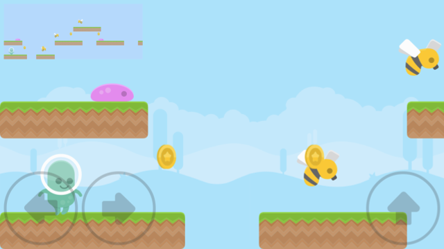

# Phaser 3 TypeScript Platformer Example

[](https://david-dm.org/yandeu/phaser3-typescript-platformer-example)


Built with the [**typescript phaser-project-template**](https://github.com/yandeu/phaser-project-template#readme) starter.

## Play

[Play the game](https://s3.eu-central-1.amazonaws.com/phaser3-typescript/platformer-example/index.html) (Add it to the homescreen to test the PWA functionality)

[](https://s3.eu-central-1.amazonaws.com/phaser3-typescript/platformer-example/index.html)

## How To Use

To clone and run this game, you'll need [Git](https://git-scm.com) and [Node.js](https://nodejs.org/en/download/) (which comes with [npm](http://npmjs.com)) installed on your computer. From your command line:

```bash
# Clone this repository
$ git clone --depth 1 https://github.com/yandeu/phaser3-typescript-platformer-example.git phaser3-platformer-example

# Go into the repository
$ cd phaser3-platformer-example

# Install dependencies
$ npm install

# Start the local development server (on port 8080)
$ npm start

# Ready for production?
# Build the production ready code to the /dist folder
$ npm run build
```
